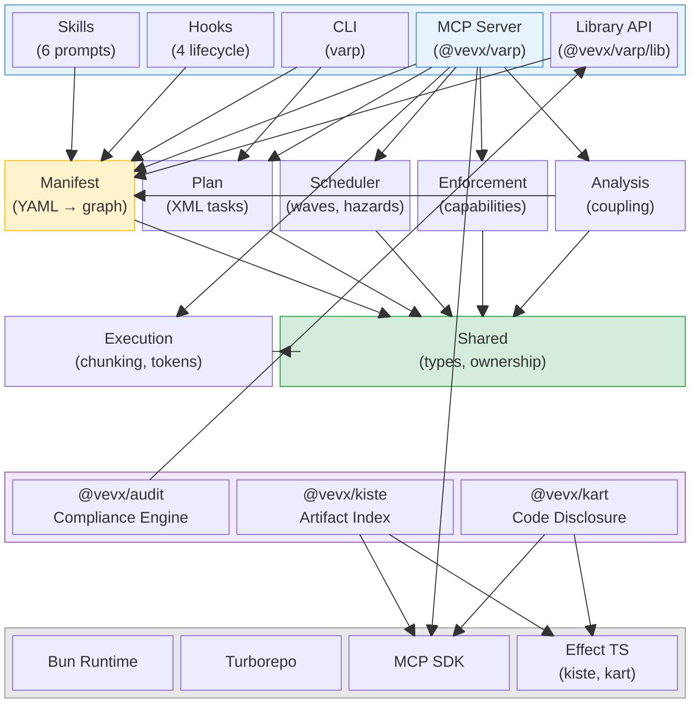
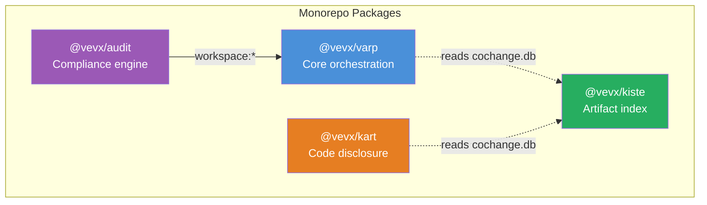
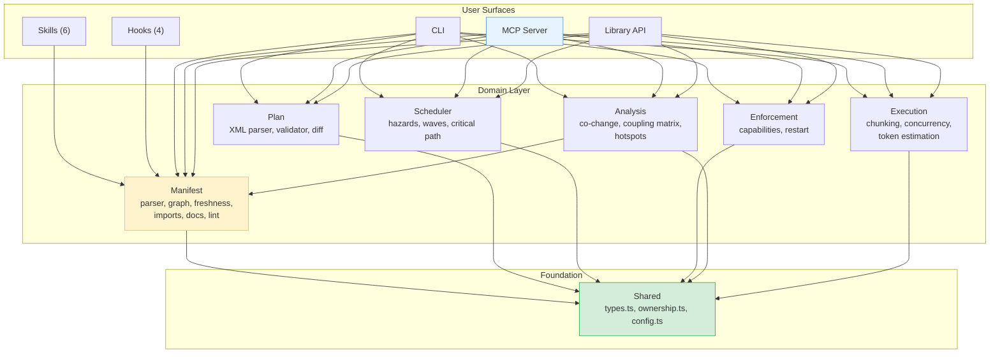
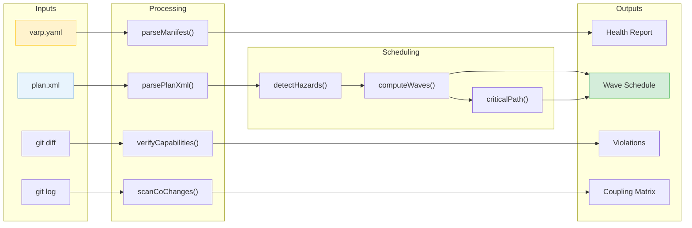

# Vevx Architecture

## Overview

```mermaid
block-beta
  columns 5

  %% ── Top row: user-facing surfaces ──
  block:surfaces:5
    columns 5
    skills["Skills\n(6 prompts)"]
    hooks["Hooks\n(4 lifecycle)"]
    cli["CLI\n(varp)"]
    mcp_varp["MCP Server\n(@vevx/varp)"]
    lib["Library API\n(@vevx/varp/lib)"]
  end

  space:5

  %% ── Domain components row ──
  manifest["Manifest\n(YAML → graph)"]
  plan["Plan\n(XML tasks)"]
  scheduler["Scheduler\n(waves, hazards)"]
  enforcement["Enforcement\n(capabilities)"]
  analysis["Analysis\n(coupling)"]

  space:5

  execution["Execution\n(chunking, tokens)"]:2
  shared["Shared\n(types, ownership)"]:3

  space:5

  %% ── Sibling packages row ──
  block:siblings:5
    columns 3
    audit["@vevx/audit\nCompliance Engine"]
    kiste["@vevx/kiste\nArtifact Index"]
    kart["@vevx/kart\nCode Disclosure"]
  end

  space:5

  %% ── External dependencies ──
  block:external:5
    columns 4
    bun["Bun Runtime"]
    turbo["Turborepo"]
    mcp_sdk["MCP SDK"]
    effect["Effect TS\n(kiste, kart)"]
  end

  %% ── Connections ──

  %% surfaces → domain
  skills --> manifest
  hooks --> manifest
  cli --> manifest
  cli --> plan
  mcp_varp --> manifest
  mcp_varp --> plan
  mcp_varp --> scheduler
  mcp_varp --> enforcement
  mcp_varp --> analysis
  mcp_varp --> execution
  lib --> manifest

  %% domain → shared
  manifest --> shared
  plan --> shared
  scheduler --> shared
  enforcement --> shared
  analysis --> shared
  analysis --> manifest
  execution --> shared

  %% audit → varp
  audit --> lib

  %% kiste/kart standalone
  kiste --> effect
  kart --> effect

  %% External
  mcp_varp --> mcp_sdk
  kiste --> mcp_sdk
  kart --> mcp_sdk

  %% Styles
  style surfaces fill:#e8f4fd,stroke:#4a90d9
  style siblings fill:#f0e8fd,stroke:#9b59b6
  style external fill:#e8e8e8,stroke:#999
  style shared fill:#d4edda,stroke:#28a745
  style manifest fill:#fff3cd,stroke:#ffc107
  style mcp_varp fill:#e8f4fd,stroke:#4a90d9
```

## Package Dependencies

```mermaid
graph TD
  subgraph "Monorepo Packages"
    varp["@vevx/varp<br/>Core orchestration"]
    audit["@vevx/audit<br/>Compliance engine"]
    kiste["@vevx/kiste<br/>Artifact index"]
    kart["@vevx/kart<br/>Code disclosure"]
  end

  audit -->|"workspace:*"| varp
  varp -.->|"reads cochange.db"| kiste
  kart -.->|"reads cochange.db"| kiste

  style varp fill:#4a90d9,color:#fff
  style audit fill:#9b59b6,color:#fff
  style kiste fill:#27ae60,color:#fff
  style kart fill:#e67e22,color:#fff
```

## Varp Internal Component Graph

```mermaid
graph TD
  subgraph "User Surfaces"
    skills["Skills (6)"]
    hooks["Hooks (4)"]
    cli["CLI"]
    mcp["MCP Server"]
    lib["Library API"]
  end

  subgraph "Domain Layer"
    manifest["Manifest<br/>parser, graph, freshness,<br/>imports, docs, lint"]
    plan["Plan<br/>XML parser, validator, diff"]
    scheduler["Scheduler<br/>hazards, waves, critical path"]
    enforcement["Enforcement<br/>capabilities, restart"]
    analysis["Analysis<br/>co-change, coupling matrix,<br/>hotspots"]
    execution["Execution<br/>chunking, concurrency,<br/>token estimation"]
  end

  subgraph "Foundation"
    shared["Shared<br/>types.ts, ownership.ts, config.ts"]
  end

  %% Surface → Domain
  skills --> manifest
  hooks --> manifest
  cli --> manifest & plan & scheduler & enforcement & analysis & execution
  mcp --> manifest & plan & scheduler & enforcement & analysis & execution
  lib --> manifest & plan & scheduler & enforcement & analysis & execution

  %% Domain → Domain
  analysis --> manifest

  %% Domain → Foundation
  manifest --> shared
  plan --> shared
  scheduler --> shared
  enforcement --> shared
  analysis --> shared
  execution --> shared

  style shared fill:#d4edda,stroke:#28a745
  style manifest fill:#fff3cd,stroke:#ffc107
  style mcp fill:#e8f4fd,stroke:#4a90d9
```

## Data Flow

```mermaid
graph LR
  subgraph "Inputs"
    yaml["varp.yaml"]
    xml["plan.xml"]
    git["git log"]
    diff["git diff"]
  end

  subgraph "Processing"
    parse_m["parseManifest()"]
    parse_p["parsePlanXml()"]
    cochange["scanCoChanges()"]
    verify["verifyCapabilities()"]
  end

  subgraph "Scheduling"
    hazards["detectHazards()"]
    waves["computeWaves()"]
    cpath["criticalPath()"]
  end

  subgraph "Outputs"
    report["Health Report"]
    schedule["Wave Schedule"]
    violations["Violations"]
    coupling["Coupling Matrix"]
  end

  yaml --> parse_m
  xml --> parse_p
  git --> cochange
  diff --> verify

  parse_m --> report
  parse_p --> hazards --> waves --> schedule
  waves --> cpath --> schedule
  cochange --> coupling
  verify --> violations

  style yaml fill:#fff3cd,stroke:#ffc107
  style xml fill:#e8f4fd,stroke:#4a90d9
  style schedule fill:#d4edda,stroke:#28a745
```
